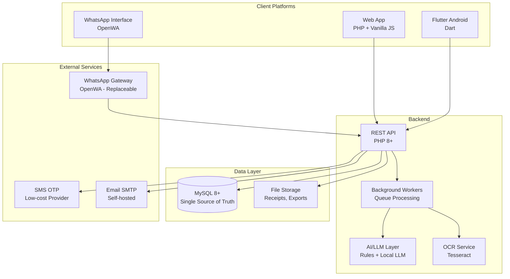

# 00 — Project Overview

## What TripBook Is

TripBook is a **Split Karo-style expense-sharing platform** combined with a **first-class personal expense tracker** and a **WhatsApp-based expense management interface** with AI assistance.

It is NOT just a trip expense splitter. It is a complete personal and shared financial management tool that happens to excel at group expense splitting.

### Core Product Identity

| Component | Description |
|-----------|-------------|
| **Shared Expense Management** | Groups, expense splitting (5 methods), debt simplification, settlements |
| **Personal Expense Tracking** | First-class personal expense/income module with categories, analytics, recurring bills |
| **WhatsApp Expense Management** | Manage expenses through WhatsApp messages with guided and natural-language flows |
| **AI Assistance** | Hybrid AI layer for intent parsing, receipt OCR, and smart suggestions |
| **Analytics & Reporting** | Personal analytics, group analytics, combined financial picture, PDF/CSV export |
| **Admin Panel** | System monitoring, user management, audit logs |

---

## Platform Targets

| Platform | Technology | Status |
|----------|-----------|--------|
| Web Application | PHP 8+ / Vanilla JS / CSS3 | Partially implemented |
| Android Application | Flutter (Dart) | Partially implemented |
| WhatsApp Interface | OpenWA/WhatsApp Web automation | Not started |
| Backend API | PHP 8+ REST API | Partially implemented |
| Database | MySQL 8+ | Partially implemented |
| Background Workers | PHP queue workers | Not started |
| AI/LLM Layer | Local LLM + rules engine | Not started |
| OCR Processing | Tesseract (self-hosted) | Not started |
| Admin Panel | PHP | Partially implemented |

All platforms share the same backend API and database. Data synchronization is mandatory across all interfaces.

---

## Architecture Overview



### Architectural Principles

1. **Single Database**: All platforms read from and write to the same MySQL database.
2. **Backend Source of Truth**: All financial calculations happen on the backend. Clients display computed values; they never compute financial data independently.
3. **Idempotent Operations**: Every create/update operation uses `client_request_id` to prevent duplicates from retries, sync, or WhatsApp message replays.
4. **Replaceable Transport Layers**: WhatsApp integration uses an adapter pattern — the OpenWA transport can be swapped for the Official WhatsApp Business Platform without changing business logic.
5. **Self-Hosted First**: Prefer self-hosted and open-source services to minimize costs. The application is free for users.
6. **Offline Resilient**: Flutter and web clients support offline transactions with conflict resolution on sync.

---

## Technology Stack

### Backend

| Component | Technology | Notes |
|-----------|-----------|-------|
| Language | PHP 8+ | Strict types, modern PHP features |
| Database | MySQL 8+ | utf8mb4, InnoDB, foreign keys |
| Web Server | Apache (XAMPP) or Nginx | PHP-FPM recommended for production |
| Session Management | PHP native sessions | Secure cookies, CSRF tokens |
| File Storage | Local filesystem | Receipt images, exports, PDFs |
| Queue System | Database-backed queue | PHP worker processes |
| WebSocket | Ratchet or similar | Real-time updates (future) |

### Frontend — Web

| Component | Technology | Notes |
|-----------|-----------|-------|
| Language | Vanilla JavaScript (ES6+) | No framework dependency |
| Styling | CSS3 with custom properties | Glassmorphism, dark theme |
| Icons | Lucide Icons | Consistent icon set |
| Font | Plus Jakarta Sans | Premium fintech feel |
| PWA | Service Worker | Offline static asset caching |

### Frontend — Flutter Android

| Component | Technology | Notes |
|-----------|-----------|-------|
| Framework | Flutter 3.9+ | Single codebase for Android |
| State Management | Provider | Lightweight, reactive |
| Networking | Dio | Interceptors for CSRF, sessions |
| Secure Storage | flutter_secure_storage | Session tokens, credentials |
| Charts | fl_chart | Analytics visualizations |
| Icons | lucide_icons | Matching web icon set |

### Integrations

| Component | Technology | Notes |
|-----------|-----------|-------|
| WhatsApp | OpenWA (WhatsApp Web automation) | Self-hosted, replaceable transport |
| OCR | Tesseract | Self-hosted receipt processing |
| LLM (primary) | Rules/regex engine | Zero cost, deterministic |
| LLM (secondary) | Local LLM (Ollama + small model) | Self-hosted, low cost |
| LLM (fallback) | Cloud LLM API | Optional, for complex cases |
| SMS OTP | Low-cost provider | Only if self-hosted SMS not feasible |
| Email | SMTP (self-hosted) | Email OTP and notifications |

---

## Locked Decisions

These decisions are locked and must not be changed without explicit approval.

| Area | Decision |
|------|----------|
| Product Type | Split Karo-style expense sharing + personal expense tracking |
| Old ₹8,000 Entry | ❌ Do NOT include anywhere in documentation or examples |
| Terminology | Product term = "Groups"; DB table = `trips` (mapping documented in `20-DATABASE-SCHEMA.md`) |
| Default Currency | INR (₹) |
| Database | MySQL 8+ |
| Financial Calculations | Backend is the single source of truth — clients never compute financial values independently |
| Payments | App RECORDS payment events only; does NOT process money transfers |
| Personal Expenses | First-class module — NOT simulated via fake groups |
| WhatsApp Transport | Self-hosted OpenWA/WhatsApp Web automation layer — replaceable adapter pattern |
| WhatsApp Flow | Incoming message → identify sender → registration check → guided expense flow |
| WhatsApp Group Parser | ❌ NOT the primary architecture — we manage 1:1 conversations, not parse group messages |
| AI Architecture | Rules first → local LLM for complex messages → optional cloud fallback |
| OCR Engine | Tesseract (self-hosted) |
| Platform Sync | Web and Flutter use the same backend/database |
| UI Direction | Purple/Indigo premium fintech style — original design, not copied |
| Design Basis | Based on provided reference images but original implementation |
| Initial Pricing | Free for users |
| Infrastructure | Prefer self-hosted/low-cost services |

---

## Module Overview

The application is divided into these functional modules. Each module has a dedicated specification document.

### Core Modules

| Module | Document | Description |
|--------|----------|-------------|
| Authentication | `05-AUTHENTICATION.md` | Phone OTP, Google OAuth, email OTP, sessions |
| Groups | `06-GROUPS.md` | Create/edit/delete groups, members, roles, settings |
| Expenses | `07-EXPENSES.md` | Shared expense CRUD, categories, receipts |
| Split Methods | `08-SPLIT-METHODS.md` | Equal, exact, percentage, shares, item-wise |
| Settlements | `09-SETTLEMENTS.md` | Debt simplification, settlement recording |
| Personal Expenses | `10-PERSONAL-EXPENSES.md` | First-class personal finance tracking |
| Bills & Reminders | `11-BILLS-AND-REMINDERS.md` | Recurring bills, due dates, reminders |
| Analytics | `12-ANALYTICS.md` | Personal, group, combined analytics |
| People & Friends | `13-PEOPLE-AND-FRIENDS.md` | Social graph, friend connections |
| Reports & Import/Export | `14-REPORTS-IMPORT-EXPORT.md` | PDF, CSV, Excel, Splitwise import |

### Integration Modules

| Module | Document | Description |
|--------|----------|-------------|
| WhatsApp Integration | `15-WHATSAPP-INTEGRATION.md` | Transport layer, message handling |
| WhatsApp Flows | `16-WHATSAPP-CONVERSATION-FLOWS.md` | Conversation state machines |
| AI & LLM | `17-AI-AND-LLM.md` | Hybrid AI architecture |
| Receipt OCR | `18-RECEIPT-OCR.md` | Camera capture, OCR processing |
| Online Bill Import | `19-ONLINE-BILL-IMPORT.md` | Vendor integration architecture |

### Technical Modules

| Module | Document | Description |
|--------|----------|-------------|
| Database Schema | `20-DATABASE-SCHEMA.md` | Complete data model |
| API Specification | `21-API-SPECIFICATION.md` | All backend contracts |
| Backend Architecture | `22-BACKEND-ARCHITECTURE.md` | PHP modules, services, queues |
| Frontend Architecture | `23-FRONTEND-ARCHITECTURE.md` | Web app architecture |
| Flutter Architecture | `24-FLUTTER-ARCHITECTURE.md` | Android app architecture |
| Notifications | `25-NOTIFICATIONS.md` | Push, in-app, WhatsApp notifications |
| Security & Privacy | `26-SECURITY-PRIVACY.md` | Auth, encryption, privacy |
| Sync & Offline | `27-SYNC-OFFLINE.md` | Data synchronization |

### Operations Modules

| Module | Document | Description |
|--------|----------|-------------|
| Admin Panel | `28-ADMIN-PANEL.md` | System management |
| Subscription & Cost | `29-SUBSCRIPTION-AND-COST.md` | Cost model, pricing |
| Testing | `30-TESTING.md` | Test strategy |
| Implementation Roadmap | `31-IMPLEMENTATION-ROADMAP.md` | Phased development plan |

---

## Financial Invariants

These invariants are non-negotiable. They are enforced by the backend and must be maintained across all platforms.

| # | Invariant | Formula | Enforced In |
|---|-----------|---------|-------------|
| F1 | Expense total equals sum of participant shares | `expense_total = Σ(share_amount)` | `07-EXPENSES.md`, `08-SPLIT-METHODS.md` |
| F2 | Settlement equals actual recorded transfer | `settlement.amount = real_world_payment` | `09-SETTLEMENTS.md` |
| F3 | Group balance follows the canonical formula | `balance = paid - responsible - settlements_received + settlements_sent` | `09-SETTLEMENTS.md`, `12-ANALYTICS.md` |
| F4 | All financial operations are idempotent | `client_request_id` checked before insert | `21-API-SPECIFICATION.md` |
| F5 | Backend is single source of truth | Clients display; backend computes | All financial docs |

### Detailed Invariant Definitions

**F1 — Expense Total = Σ(Participant Shares)**

When an expense of ₹1,000 is created and split among 3 people:
- Person A's share: ₹400
- Person B's share: ₹350
- Person C's share: ₹250
- Verification: ₹400 + ₹350 + ₹250 = ₹1,000 ✓

If rounding causes a discrepancy, the backend adjusts the largest share to ensure exact equality. This is documented in `08-SPLIT-METHODS.md`.

**F2 — Settlement = Actual Recorded Transfer**

A settlement record represents a real-world payment. It does NOT create new debt or modify expense records. It only adjusts balances. The app records that "User A paid User B ₹500 via UPI" — it does not process the UPI transaction.

**F3 — Group Balance Formula**

For any user in a group:

```
net_balance = total_paid - total_share - settlements_received + settlements_sent
```

Where:
- `total_paid` = sum of all expense amounts this user paid for the group
- `total_share` = sum of this user's shares in all group expenses
- `settlements_received` = sum of settlements this user received from others
- `settlements_sent` = sum of settlements this user sent to others

A positive balance means the user is **owed money**. A negative balance means the user **owes money**.

**F4 — Idempotency**

Every create/update API call accepts a `client_request_id` (UUID). The server checks for an existing record with the same `client_request_id` before inserting. If found, it returns the existing record instead of creating a duplicate. This protects against:
- Flutter offline retry
- WhatsApp message replay
- Live sync race conditions
- Network timeout retries

**F5 — Backend Source of Truth**

The web client, Flutter app, and WhatsApp interface all display financial data computed by the backend. No client-side calculation of balances, settlements, or totals is authoritative. Clients may show optimistic UI updates, but the backend response is always the final state.

---

## Existing Codebase Mapping

The current codebase uses different terminology than the product specification. This mapping is critical for developers working across both:

| Product Term | Database Table | Existing Code Reference |
|-------------|----------------|------------------------|
| Group | `trips` | `api/trips.php`, `pages/home.php`, `api/dashboard.php` |
| Group Member | `trip_members` | `api/members.php` |
| Group Expense | `transactions` (type=expense) | `api/expenses.php`, `api/transactions.php` |
| Settlement | `settlements` | `api/settlements.php` |
| Personal Expense | `transactions` (trip_id=NULL) | `api/cashbook.php` |
| Category | `categories` | `api/categories.php` |

The existing database schema (`sql/schema.sql`) contains 13 tables. The full specification in `20-DATABASE-SCHEMA.md` will expand this to cover all new modules.

---

## Open Questions

| # | Question | Impact | Document |
|---|----------|--------|----------|
| OQ-1 | Should UPI deep-linking be supported for 1-tap settlement? | Settlement UX, payment integration | `09-SETTLEMENTS.md` |
| OQ-2 | What is the email notification frequency and batching strategy? | Notification volume, user experience | `25-NOTIFICATIONS.md` |
| OQ-3 | Is real-time currency conversion required for multi-currency groups? | Exchange rate API, complexity | `06-GROUPS.md` |
| OQ-4 | What is the data retention policy beyond account deletion? | Compliance, storage | `26-SECURITY-PRIVACY.md` |
| OQ-5 | Single WhatsApp number or multiple for scale? | Infrastructure, cost | `15-WHATSAPP-INTEGRATION.md` |
| OQ-6 | Should the app support multi-language UI beyond English/Hindi? | Internationalization scope | `04-DESIGN-SYSTEM.md` |
| OQ-7 | What is the maximum group size the app must support? | Performance, UI design | `06-GROUPS.md` |

---

## Dependencies

- None (this is the root document).

## Related Documents

- `01-FEATURES.md` — Complete feature inventory
- `20-DATABASE-SCHEMA.md` — Database table definitions
- `21-API-SPECIFICATION.md` — Backend API contracts
- `31-IMPLEMENTATION-ROADMAP.md` — Development phases
