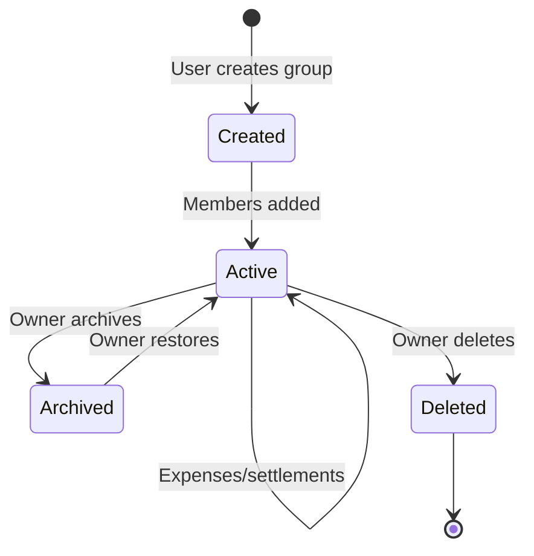

# 06 — Groups

This document specifies the Group module. A Group is the core shared context in TripBook — it represents a trip, flat, event, or any shared expense context.

**Terminology**: The product term is "Group". The database table is `trips`. All user-facing text uses "Group"; all database references use `trips`.

---

## Group Lifecycle



---

## 1. Create Group

### Rules

| Rule | Value |
|------|-------|
| Creator role | `owner` |
| Minimum members | 1 (creator) |
| Maximum members | No hard limit (UI recommends ≤50 for performance) |
| Group name required | Yes, 1-150 characters |
| Description | Optional, max 500 characters |
| Currency | Default INR, configurable per group |
| Starting money | Optional, defaults to 0 |

### Database: `trips` Table

| Field | Type | Nullable | Default | Purpose |
|-------|------|----------|---------|---------|
| id | INT UNSIGNED PK | No | auto | Unique group ID |
| trip_code | VARCHAR(20) UNIQUE | No | generated | Shareable code |
| url_token | VARCHAR(8) | Yes | generated | URL-friendly token |
| name | VARCHAR(150) | No | — | Group name |
| description | TEXT | Yes | NULL | Group description |
| starting_money | DECIMAL(12,2) | No | 0.00 | Initial cash pool |
| starting_payer_id | INT UNSIGNED FK | Yes | NULL | Who contributed starting money |
| starting_payment_method | ENUM | No | 'cash' | Payment method for starting money |
| currency | VARCHAR(10) | No | 'INR' | Currency code |
| currency_symbol | VARCHAR(5) | No | '₹' | Currency symbol |
| created_by | INT UNSIGNED FK | No | — | Owner user ID |
| created_at | TIMESTAMP | No | NOW() | Creation timestamp |
| updated_at | TIMESTAMP | No | NOW() | Last update timestamp |

### Trip Code Generation

- Format: `TRIP-XXXXX` (5 alphanumeric characters)
- Characters: A-Z, 0-9 (excluding confusing chars: 0, O, I, 1)
- Unique: Checked against existing codes on creation
- Used for: Join group by code

### URL Token Generation

- Format: 8-character MD5 hash of trip ID + secret
- Used for: Shareable URLs
- Example: `http://app.com/group/a1b2c3d4`

### API Endpoints

| Endpoint | Method | Action |
|----------|--------|--------|
| `api/trips.php` | POST | Create group |
| `api/trips.php` | GET | List user's groups |

### Validation

| Field | Rule | Error |
|-------|------|-------|
| name | Required, 1-150 chars | "Group name is required" |
| description | Max 500 chars | "Description too long" |
| starting_money | ≥ 0, max 2 decimals | "Invalid starting amount" |
| currency | Valid ISO 4217 code | "Invalid currency" |

---

## 2. Edit Group

### Permissions

| Field | Who Can Edit |
|-------|-------------|
| name | Owner, Admin |
| description | Owner, Admin |
| starting_money | Owner only |
| starting_payment_method | Owner only |
| currency | Owner only |

### API Endpoints

| Endpoint | Method | Action |
|----------|--------|--------|
| `api/trips.php` | POST (action=update) | Update group settings |

---

## 3. Delete/Archive Group

### Delete Rules

| Rule | Value |
|------|-------|
| Who can delete | Owner only |
| Pre-condition | All balances must be settled (net_balance = 0 for all members) |
| Cascade | Deletes all expenses, splits, settlements, notifications for the group |
| Soft delete | 30-day recovery period, then hard delete |

### Archive Rules

| Rule | Value |
|------|-------|
| Who can archive | Owner, Admin |
| Effect | Group hidden from main list, data preserved |
| Restore | Owner can restore at any time |
| Expenses during archive | Cannot add new expenses while archived |

### API Endpoints

| Endpoint | Method | Action |
|----------|--------|--------|
| `api/trips.php` | POST (action=delete) | Delete group |
| `api/trips.php` | POST (action=archive) | Archive group |

---

## 4. Group Members

### Member Roles

| Role | Permissions |
|------|-------------|
| `owner` | Full control: edit group, manage members, delete group, all member permissions |
| `admin` | Manage members (add/remove), edit group settings, all member permissions |
| `member` | View group, add expenses, view balances, settle up |

### Database: `trip_members`

| Field | Type | Nullable | Default | Purpose |
|-------|------|----------|---------|---------|
| id | INT UNSIGNED PK | No | auto | Unique record ID |
| trip_id | INT UNSIGNED FK | No | — | Group ID |
| user_id | INT UNSIGNED FK | No | — | User ID |
| role | ENUM | No | 'member' | Owner/Admin/Member |
| joined_at | TIMESTAMP | No | NOW() | Join timestamp |

**Unique constraint**: (`trip_id`, `user_id`) — one membership per user per group.

### Add Member

| Rule | Value |
|------|-------|
| Who can add | Owner, Admin |
| Method | Phone number lookup or invite code |
| Auto-join | If phone number matches registered user, add directly |
| Invitation | If not registered, send invite link |
| Duplicate | Reject with "User already in group" error |

### Remove Member

| Rule | Value |
|------|-------|
| Who can remove | Owner (any member), Admin (non-owner members) |
| Self-removal | Any member can leave (except sole owner) |
| Owner transfer | Owner must transfer ownership before leaving |
| Active expenses | Member can be removed even with active balances |
| Balance cleanup | Removal does not auto-settle balances |

### Change Role

| Rule | Value |
|------|-------|
| Who can change | Owner only |
| Owner transfer | Owner can transfer ownership to any member |
| Effect | Role change is immediate |

### API Endpoints

| Endpoint | Method | Action |
|----------|--------|--------|
| `api/members.php` | GET | List members with balances |
| `api/members.php` | POST (action=add) | Add member by phone |
| `api/members.php` | POST (action=remove) | Remove member |
| `api/members.php` | POST (action=update_role) | Change member role |

### Member List Response

Each member includes:
- User ID, name, email, phone, avatar_color
- Role (owner/admin/member)
- Net balance (from Splitwise calculation)
- Total paid, total share
- Settlements sent/received

---

## 5. Join Group

### Methods

| Method | Flow |
|--------|------|
| Trip code | User enters 5-char code → validates → adds as member |
| URL token | User opens link → validates token → adds as member |
| Direct invite | Owner/Admin adds by phone number |

### Join by Code

```
User enters trip_code (e.g., "TRIP-DXQAT")
  → Backend looks up trips table
  → Decision: Code exists?
    → NO: Error "Invalid group code"
    → YES: Decision: User already member?
      → YES: Switch to that group
      → NO: Add user as member (role: 'member')
```

### Join by URL Token

```
User opens URL with token (e.g., /group/a1b2c3d4)
  → Backend resolves token to trip_id
  → Backend checks if user is authenticated
  → Decision: Authenticated?
    → NO: Redirect to login, then add
    → YES: Decision: Already member?
      → YES: Switch to group
      → NO: Add as member
```

### API Endpoints

| Endpoint | Method | Action |
|----------|--------|--------|
| `api/trips.php` | POST (action=join) | Join by trip_code |
| `api/trips.php` | POST (action=resolve_token) | Join by URL token |

---

## 6. Group Currency

### Supported Currencies

| Code | Symbol | Name |
|------|--------|------|
| INR | ₹ | Indian Rupee (default) |
| USD | $ | US Dollar |
| EUR | € | Euro |
| GBP | £ | British Pound |
| JPY | ¥ | Japanese Yen |
| AED | د.إ | UAE Dirham |
| SAR |﷼ | Saudi Riyal |

### Currency Rules

| Rule | Value |
|------|-------|
| Default | INR (₹) |
| Per-group setting | Each group has its own currency |
| Changing currency | Owner only, does not convert existing amounts |
| Display format | `{symbol}{amount}` (e.g., ₹1,500) |
| Indian numbering | Lakhs/Crores format for INR |

---

## 7. Starting Money Pool

### Purpose

The starting money pool represents cash that was collected before the trip/group started. It is tracked separately from expenses.

### Rules

| Rule | Value |
|------|-------|
| Who sets | Creator during group creation (optional) |
| Payer | Creator (or specified user) |
| Payment method | Cash, UPI, Card, Bank |
| Effect on balances | Starting payer's balance is adjusted |
| Effect on cash pool | Added to available shared money |

### Balance Impact

When starting money = ₹8,000 paid by User A:
- User A's `total_paid` increases by ₹8,000
- Available shared money = Starting money + Added money - Total spent

---

## 8. Group Analytics

### Available Metrics

| Metric | Description |
|--------|-------------|
| Total group expense | Sum of all shared expenses |
| Expense count | Number of expenses |
| Average expense | Total / count |
| Per-member contribution | What each member paid |
| Per-member share | What each member owes |
| Category breakdown | Spending by category |
| Settlement analytics | Total settled, pending settlements |
| Activity timeline | Chronological event log |

### API Endpoints

| Endpoint | Method | Action |
|----------|--------|--------|
| `api/dashboard.php` | GET | Full dashboard with group analytics |

---

## 9. Group Activity

### Tracked Events

| Event | Description |
|-------|-------------|
| group.created | Group was created |
| member.joined | A member joined |
| member.left | A member left |
| member.removed | A member was removed |
| expense.created | Expense added |
| expense.edited | Expense modified |
| expense.deleted | Expense removed |
| settlement.recorded | Settlement recorded |
| group.settings_changed | Group settings modified |

### Activity Log

Each activity entry:
- Event type
- Actor (who performed the action)
- Target (what was affected)
- Timestamp
- Metadata (amount, description, etc.)

---

## Open Questions

| # | Question | Impact |
|---|----------|--------|
| OQ-1 | Should groups have a maximum member limit? | Performance, UI design |
| OQ-2 | Should group types (trip/flat/event) affect UI or behavior? | Feature scope |
| OQ-3 | Should archived groups count toward user's group limit? | Business rules |
| OQ-4 | Should we support group templates (pre-configured categories)? | UX enhancement |

---

## Dependencies

- `05-AUTHENTICATION.md` — User identity, session management
- `04-DESIGN-SYSTEM.md` — Group screen components

## Related Documents

- `07-EXPENSES.md` — Expenses within groups
- `09-SETTLEMENTS.md` — Settlements within groups
- `12-ANALYTICS.md` — Group analytics formulas
- `20-DATABASE-SCHEMA.md` — trips, trip_members, member_accounts tables
- `21-API-SPECIFICATION.md` — Group API endpoint details
