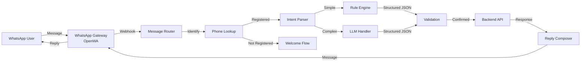

# 15 — WhatsApp Integration

This document specifies the WhatsApp transport layer, message handling architecture, and integration design.

---

## Architecture Principle

> The WhatsApp transport layer is a **replaceable adapter**. The initial implementation uses OpenWA (WhatsApp Web automation). The architecture allows swapping to the Official WhatsApp Business Platform without changing business logic.

---

## 1. System Architecture



---

## 2. Message Router

### Incoming Message Processing

```
1. Receive webhook from WhatsApp Gateway
2. Extract: sender_phone, message_text, timestamp, message_id
3. Check message_id for deduplication (F4: idempotency)
4. Look up sender_phone in users table
5. Decision: User registered?
   → NO: Send welcome message, stop
   → YES: Continue to intent parsing
```

### Database: `whatsapp_messages`

| Field | Type | Nullable | Default | Purpose |
|-------|------|----------|---------|---------|
| id | INT UNSIGNED PK | No | auto | Message ID |
| whatsapp_message_id | VARCHAR(100) UNIQUE | No | — | WhatsApp's message ID (dedup key) |
| sender_phone | VARCHAR(30) | No | — | Sender's phone number |
| direction | ENUM | No | — | inbound/outbound |
| message_text | TEXT | Yes | NULL | Text content |
| message_type | ENUM | No | 'text' | text/image/document |
| media_url | VARCHAR(500) | Yes | NULL | Media attachment URL |
| status | ENUM | No | 'received' | received/processed/replied/failed |
| conversation_state | VARCHAR(50) | Yes | NULL | Current conversation state |
| ai_confidence | DECIMAL(3,2) | Yes | NULL | AI confidence score |
| raw_payload | JSON | Yes | NULL | Full WhatsApp webhook payload |
| created_at | TIMESTAMP | No | NOW() | Message timestamp |

### Database: `whatsapp_conversations`

| Field | Type | Nullable | Default | Purpose |
|-------|------|----------|---------|---------|
| id | INT UNSIGNED PK | No | auto | Conversation ID |
| user_id | INT UNSIGNED FK | No | — | User |
| phone_number | VARCHAR(30) | No | — | Phone number |
| state | VARCHAR(50) | No | 'idle' | Current state |
| context_data | JSON | Yes | NULL | Conversation context |
| last_message_at | TIMESTAMP | No | NOW() | Last message timestamp |
| is_active | TINYINT(1) | No | 1 | Active conversation |
| created_at | TIMESTAMP | No | NOW() | Conversation start |

### Database: `whatsapp_conversation_state`

| Field | Type | Nullable | Default | Purpose |
|-------|------|----------|---------|---------|
| id | INT UNSIGNED PK | No | auto | State ID |
| conversation_id | INT UNSIGNED FK | No | — | Parent conversation |
| state_name | VARCHAR(50) | No | — | State identifier |
| state_data | JSON | Yes | NULL | State-specific data |
| entered_at | TIMESTAMP | No | NOW() | When state was entered |

---

## 3. Phone Number Lookup

### Process

```
1. Normalize phone number: remove spaces, dashes, + prefix
2. Query users table: SELECT id, name FROM users WHERE phone = ?
3. If found: Identify user, proceed to intent parsing
4. If not found: Send welcome message
```

### Welcome Message (Unregistered User)

```
Hi! 👋 Welcome to TripBook!

To manage your expenses via WhatsApp, you need to register first.

📱 Android App: [install link]
🌐 Web App: [signup link]

Register with this phone number to get started!
```

---

## 4. Transport Adapter Interface

### Interface Definition

```php
interface WhatsAppTransport {
    public function sendMessage(string $phone, string $message): bool;
    public function sendImage(string $phone, string $imageUrl, ?string $caption = null): bool;
    public function onMessage(callable $handler): void;
    public function getConnectionStatus(): array;
}
```

### OpenWA Adapter (Initial Implementation)

| Property | Value |
|----------|-------|
| Protocol | WebSocket |
| Self-hosted | Yes |
| Dependencies | OpenWA-node |
| Session persistence | Local file |
| Rate limits | WhatsApp Web limits |

### Official WhatsApp Business Platform Adapter (Future)

| Property | Value |
|----------|-------|
| Protocol | REST API |
| Self-hosted | No (cloud) |
| Dependencies | WhatsApp Business API |
| Session management | Cloud-managed |
| Rate limits | Official tier-based |

---

## 5. Message Deduplication (F4)

### Deduplication Keys

| Key | Source | Use Case |
|-----|--------|----------|
| `whatsapp_message_id` | WhatsApp's unique message ID | Prevent duplicate processing |
| `client_request_id` | Our generated UUID | Prevent duplicate actions |

### Process

```
1. Receive message with whatsapp_message_id
2. Check: SELECT id FROM whatsapp_messages WHERE whatsapp_message_id = ?
3. If exists: Return existing response (idempotent)
4. If not: Process and store new message
```

---

## 6. Message Queue

### Purpose

WhatsApp messages are processed asynchronously to:
- Handle rate limits
- Allow retry on failure
- Decouple gateway from business logic

### Queue Table: `whatsapp_message_queue`

| Field | Type | Purpose |
|-------|------|---------|
| id | INT UNSIGNED PK | Queue entry ID |
| whatsapp_message_id | VARCHAR(100) | Dedup key |
| sender_phone | VARCHAR(30) | Sender |
| message_text | TEXT | Message content |
| status | ENUM | pending/processing/completed/failed |
| attempts | INT | Retry count |
| created_at | TIMESTAMP | Queue time |
| processed_at | TIMESTAMP | Processing time |

---

## 7. Security

| Rule | Value |
|------|-------|
| Phone number validation | Must match registered user |
| Session isolation | Each user has independent conversation state |
| Rate limiting | 30 messages per minute per user |
| Message retention | Raw messages deleted after 30 days |
| Media handling | Temporary storage, deleted after processing |

---

## Open Questions

| # | Question | Impact |
|---|----------|--------|
| OQ-1 | Single WhatsApp number or multiple for scale? | Infrastructure cost |
| OQ-2 | Should WhatsApp support group chat management? | Feature scope |
| OQ-3 | Should we support WhatsApp status for expense summaries? | Feature scope |

---

## Dependencies

- `05-AUTHENTICATION.md` — User identity (phone lookup)
- `17-AI-AND-LLM.md` — Intent parsing
- `07-EXPENSES.md` — Expense creation
- `09-SETTLEMENTS.md` — Settlement recording

## Related Documents

- `16-WHATSAPP-CONVERSATION-FLOWS.md` — Conversation state machines
- `17-AI-AND-LLM.md` — AI intent parsing
- `20-DATABASE-SCHEMA.md` — WhatsApp tables
- `22-BACKEND-ARCHITECTURE.md` — WhatsApp service implementation
