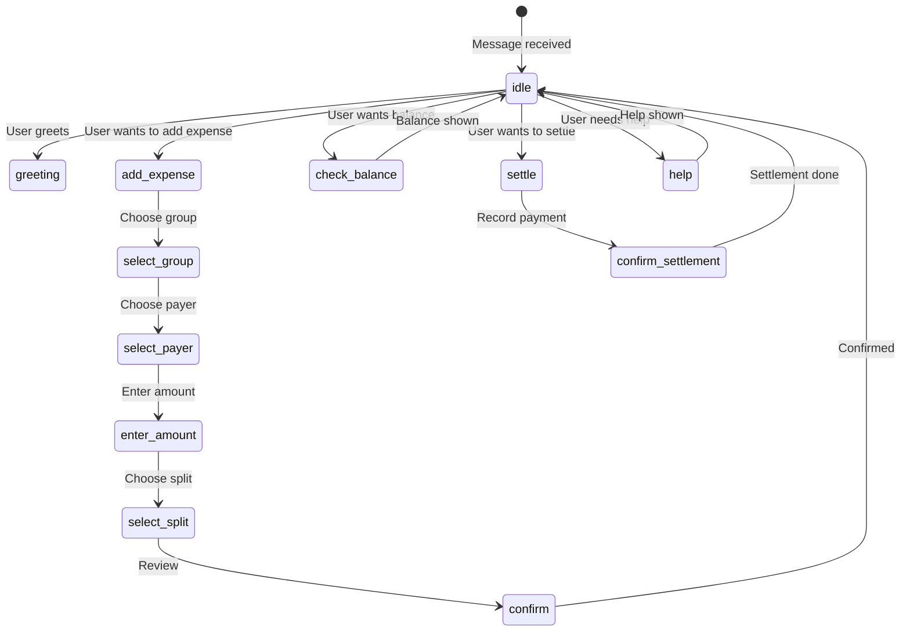

# 16 — WhatsApp Conversation Flows

This document specifies every conversation state machine, guided flow, and natural language pattern for the WhatsApp interface.

---

## Conversation State Machine



---

## 1. Idle State (Default)

### Triggers

Any message from a registered user that doesn't match a specific intent.

### Response

```
Hi {name}! 👋 How can I help you today?

1. 💰 Add Expense
2. 📊 Check Balances
3. ✅ Record Settlement
4. 📋 Recent Activity
5. ❓ Help

Type a number or describe what you want to do.
```

---

## 2. Add Expense Flow

### Step 1: Select Group

**Trigger**: User sends "add expense" / "expense add karo" / "paisa lagao"

**System Response**:
```
Which group do you want to add an expense to?

1. 🏖️ Goa Trip
2. 🏠 Flat Expenses
3. 👥 College Friends

Reply with the number or group name.
```

**User Responses**:
- "1" → Selects Goa Trip
- "Goa Trip" → Selects Goa Trip
- "Flat" → Selects Flat Expenses

### Step 2: Select Payer

**System Response**:
```
Who paid for this expense?

1. 👤 You
2. 👤 Rahul
3. 👤 Priya

Reply with the number or name.
```

**User Responses**:
- "1" or "me" / "maine" → Current user
- "Rahul" → Rahul

### Step 3: Enter Amount

**System Response**:
```
How much was the expense?

Type the amount (e.g., 1500)
```

**User Responses**:
- "1500" → Amount set
- "1500 for dinner" → Amount + description
- "dinner 1500" → Description + amount (AI parsed)

### Step 4: Select Split Method

**System Response**:
```
How should this be split?

1. ⚖️ Equal (₹500 each among 3)
2. 🔢 Exact amounts
3. 📊 Percentage
4. 📦 Item-wise

Reply with the number.
```

**User Responses**:
- "1" or "equal" → Equal split
- "2" → Enter exact amounts
- Custom text → AI parsed

### Step 5: Confirm

**System Response**:
```
📋 Review Expense:

💰 Amount: ₹1,500
👤 Paid by: You
👥 Split: Equal among 3 (₹500 each)
📝 Description: Dinner
🏷️ Category: Food & Drinks
📅 Date: Today

✅ Confirm
❌ Cancel
🔄 Edit

Reply with your choice.
```

**User Responses**:
- "confirm" / "yes" / "haan" → Save expense
- "cancel" / "no" / "nahi" → Cancel
- "edit" → Go back to modify

### Step 6: Success

**System Response**:
```
✅ Expense Added!

💰 ₹1,500 for Dinner
👤 You paid
👥 Split equally:
   • Rahul owes you ₹500
   • Priya owes you ₹500

Anything else I can help with?
```

---

## 3. Natural Language Expense Parsing

### Supported Patterns

| Pattern | Language | Example |
|---------|----------|---------|
| "Maine {desc} ke {amount} diye" | Hinglish | "Maine dinner ke 1500 diye" |
| "{desc} {amount} personal add karo" | Hinglish | "Uber 500 personal add karo" |
| "Add expense {amount} for {desc}" | English | "Add expense 1500 for dinner" |
| "{amount} {desc} with {people}" | English | "1500 dinner with Rahul and Priya" |
| "Rahul aur Priya ke saath {amount} split karo" | Hinglish | "Rahul aur Priya ke saath 1500 split karo" |

### AI Extraction Output

```json
{
  "intent": "add_expense",
  "amount": 1500,
  "description": "dinner",
  "participants": ["Rahul", "Priya"],
  "split_method": "equal",
  "is_personal": false,
  "confidence": 0.92,
  "language": "hinglish"
}
```

### Response Flow

After AI extraction:
1. Show parsed data for confirmation
2. User confirms or corrects
3. System creates expense

---

## 4. Check Balance Flow

### Trigger

User sends: "balance" / "kitna baki hai" / "balance check karo" / "who owes whom"

### System Response

```
📊 Your Balances:

🏖️ Goa Trip:
  ✅ Rahul owes you ₹800
  ❌ You owe Priya ₹200
  📈 Net: You're owed ₹600

🏠 Flat Expenses:
  ❌ You owe Amit ₹1,500

Reply with a group name for details.
```

---

## 5. Record Settlement Flow

### Trigger

User sends: "settle" / "payment record karo" / "Rahul ko 500 de diya"

### Flow

```
System: Which group?
  → User: Goa Trip
System: Who did you pay?
  → User: Rahul
System: How much?
  → User: 500
System: Payment method?
  → User: UPI
System: Confirm:
  💸 You paid Rahul ₹500 via UPI
  ✅ Confirm / ❌ Cancel
  → User: Confirm
System: ✅ Recorded! Your balance with Rahul is now ₹300.
```

---

## 6. Help Flow

### Trigger

User sends: "help" / "kya kar sakte ho" / "options"

### System Response

```
❓ TripBook Help:

💰 EXPENSES
• "Add expense" — Start adding an expense
• "1500 dinner add karo" — Quick add
• "Maine 500 diye" — Natural language

📊 BALANCES
• "Balance" — See all balances
• "Goa trip balance" — Group-specific

✅ SETTLEMENTS
• "Settle" — Record a payment
• "Rahul ko 500 diya" — Quick settle

📋 OTHER
• "Recent" — Recent activity
• "Help" — This message

Type any of these commands!
```

---

## 7. Error Handling

### Unknown Intent

```
Sorry, I didn't understand that. 😅

Try one of these:
• "Add expense" — Add an expense
• "Balance" — Check balances
• "Help" — See all commands
```

### Invalid Amount

```
Hmm, that doesn't look like a valid amount. 🤔

Please enter a number like:
• 1500
• 1,500
• 1500.50
```

### Group Not Found

```
I couldn't find a group matching "{input}". 

Your groups:
1. Goa Trip
2. Flat Expenses

Reply with the number or exact name.
```

### Not Registered

```
Hi! 👋 Welcome to TripBook!

To manage expenses via WhatsApp, register first:

📱 Android: [link]
🌐 Web: [link]

Use the same phone number to link your account!
```

---

## 8. Conversation Timeout

| Rule | Value |
|------|-------|
| Idle timeout | 30 minutes |
| After timeout | Reset to idle state |
| Partial flow | Discard, start fresh |

---

## Open Questions

| # | Question | Impact |
|---|----------|--------|
| OQ-1 | Should the guided flow support interrupting and resuming? | State management complexity |
| OQ-2 | Should we support voice messages? | AI scope |
| OQ-3 | Should WhatsApp support image receipt scanning? | Feature scope |

---

## Dependencies

- `15-WHATSAPP-INTEGRATION.md` — Transport layer
- `17-AI-AND-LLM.md` — Intent parsing
- `07-EXPENSES.md` — Expense creation
- `08-SPLIT-METHODS.md` — Split calculations
- `09-SETTLEMENTS.md` — Settlement recording

## Related Documents

- `15-WHATSAPP-INTEGRATION.md` — Architecture
- `17-AI-AND-LLM.md` — AI processing
- `02-USER-FLOWS.md` — WhatsApp user flows
