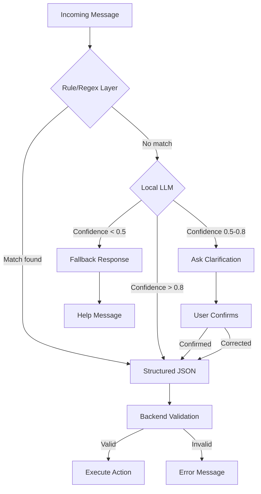

# 17 — AI and LLM

This document specifies the hybrid AI architecture: rules first, local LLM for complex messages, optional cloud fallback.

---

## Architecture Principle

> The LLM must NOT be the source of truth for balances, calculations, split amounts, settlements, or financial totals. The backend calculates all financial values.

---

## 1. Hybrid Processing Pipeline



---

## 2. Rule/Regex Layer (Zero Cost)

### Patterns

| Intent | Pattern (English) | Pattern (Hinglish) |
|--------|-------------------|---------------------|
| add_expense | `add expense (\d+)` | `expense add karo (\d+)` |
| add_expense | `spent (\d+) on (.+)` | `(.+) ke (\d+) diye` |
| check_balance | `balance` | `balance check\|kitna baki` |
| settle | `settle\|paid (\d+)` | `(.+) ko (\d+) de diya` |
| help | `help\|options` | `help\|kya kar sakte ho` |
| greeting | `hi\|hello\|hey` | `hi\|hello\|namaste` |

### Extraction Rules

```php
$patterns = [
    'add_expense' => [
        '/Maine\s+(.+?)\s+ke\s+(\d+)\s+diye/i',
        '/(\d+)\s+(.+?)\s+(?:with|aur)\s+(.+)/i',
        '/Add expense\s+(\d+)\s+for\s+(.+)/i',
    ],
    'check_balance' => [
        '/balance/i',
        '/kitna\s+baki/i',
        '/who\s+owes/i',
    ],
    'settle' => [
        '/(.+?)\s+ko\s+(\d+)\s+de diya/i',
        '/paid\s+(\d+)\s+to\s+(.+)/i',
    ],
];
```

### Confidence Scoring

| Match Type | Confidence |
|-----------|-----------|
| Exact pattern match | 0.95-1.00 |
| Partial pattern match | 0.80-0.94 |
| Keyword match only | 0.60-0.79 |
| No match | 0.00 |

---

## 3. Local LLM (Secondary)

### Model Selection Criteria

| Criterion | Requirement |
|-----------|-------------|
| Size | ≤ 7B parameters (for self-hosting) |
| Latency | < 2 seconds response time |
| Cost | Self-hosted (zero marginal cost) |
| Quality | Good multilingual support |
| Fine-tuning | Ability to fine-tune on expense data |

### Recommended Models

| Model | Size | Reason |
|-------|------|--------|
| Mistral 7B | 7B | Good multilingual, fast |
| Llama 3.1 8B | 8B | Strong instruction following |
| Phi-3 Mini | 3.8B | Very fast, good for structured extraction |
| Qwen2 7B | 7B | Excellent multilingual (Hindi/English) |

### Deployment

- Hosted via Ollama or vLLM
- Behind internal API endpoint
- Rate limited to prevent overload
- GPU-accelerated if available

### Prompt Template

```
You are an expense management assistant. Extract structured data from the user's message.

User message: "{message}"
User's groups: {groups}
User's contacts: {contacts}

Extract:
- intent: add_expense | check_balance | settle | help | greeting
- amount: number or null
- description: string or null
- participants: array of names or null
- split_method: equal | exact | percentage | null
- is_personal: boolean
- confidence: 0.0 to 1.0

Return ONLY valid JSON.
```

---

## 4. Cloud LLM Fallback (Optional)

### When Used

- Local LLM confidence < 0.5
- Local LLM unavailable
- Complex multi-turn conversation

### Provider Options

| Provider | Cost | Quality | Latency |
|----------|------|---------|---------|
| OpenAI GPT-4o-mini | Low | High | Medium |
| Google Gemini Flash | Low | High | Low |
| Anthropic Haiku | Low | High | Medium |

### Cost Controls

| Rule | Value |
|------|-------|
| Max calls per user per day | 10 |
| Max calls per message | 1 |
| Timeout | 5 seconds |
| Cache | Results cached for identical messages |

---

## 5. Structured JSON Output

### Schema

```json
{
  "intent": "add_expense | check_balance | settle | help | greeting | unknown",
  "amount": "number | null",
  "description": "string | null",
  "participants": ["string"] | null,
  "split_method": "equal | exact | percentage | shares | null",
  "category_suggestion": "string | null",
  "is_personal": "boolean",
  "confidence": "number (0.0 - 1.0)",
  "language": "en | hi | hinglish | other",
  "requires_clarification": "boolean",
  "clarification_question": "string | null"
}
```

### Validation Rules

| Field | Rule |
|-------|------|
| intent | Must be one of the defined values |
| amount | Must be > 0 if not null |
| participants | Must match known contacts if not null |
| confidence | Must be 0.0-1.0 |
| description | Max 255 characters |

---

## 6. Confidence Thresholds

| Confidence | Action |
|-----------|--------|
| ≥ 0.85 | Auto-execute with confirmation |
| 0.60 - 0.84 | Show parsed data, ask for confirmation |
| 0.40 - 0.59 | Ask clarifying question |
| < 0.40 | Show help message |

---

## 7. Fallback Behavior

### Low Confidence Response

```
I'm not sure I understood that. 🤔

Did you mean:
1. Add an expense
2. Check your balance
3. Record a settlement

Or type "help" for all options.
```

### Ambiguous Message

```
I found a few possibilities:

1. Add expense: ₹1,500 for dinner with Rahul
2. Add expense: ₹1,500 for dinner (personal)

Which one did you mean?
```

---

## 8. Multilingual Handling

### Supported Languages

| Language | Coverage | Method |
|----------|----------|--------|
| English | Full | Rules + LLM |
| Hindi | Full | Rules + LLM |
| Hinglish | Full | Rules + LLM |
| Other Indian languages | Partial | LLM only |

### Language Detection

- Script detection (Devanagari → Hindi)
- Keyword detection (common Hindi/Hinglish words)
- LLM-based detection for mixed language

---

## 9. Hallucination Prevention

### Rules

| Rule | Description |
|------|-------------|
| Never invent amounts | Only use amounts explicitly stated by user |
| Never invent names | Only use names from user's contacts |
| Never auto-confirm | Always show parsed data for user confirmation |
| Validate against backend | Check participants exist, groups exist |
| Financial invariant check | Backend validates F1 before saving |

### Response Verification

```
1. AI extracts structured data
2. Backend validates:
   - Amount exists and > 0
   - Participants are group members
   - Group exists
   - Split method is valid
3. If validation fails: ask for clarification
4. If validation passes: show for confirmation
```

---

## 10. Privacy

| Rule | Value |
|------|-------|
| Message retention | Raw messages deleted after 30 days |
| LLM processing | Messages processed in memory, not logged |
| Cloud fallback | Only non-sensitive data sent (no full conversation history) |
| User consent | Users informed about AI processing in privacy policy |

---

## Open Questions

| # | Question | Impact |
|---|----------|--------|
| OQ-1 | Should the LLM support expense categorization suggestions? | Feature scope |
| OQ-2 | Should we fine-tune a model on expense conversation data? | Quality vs. effort |
| OQ-3 | Should we support voice-to-text before LLM processing? | Feature scope |

---

## Dependencies

- `15-WHATSAPP-INTEGRATION.md` — Message handling
- `16-WHATSAPP-CONVERSATION-FLOWS.md` — Conversation states
- `07-EXPENSES.md` — Expense creation
- `29-SUBSCRIPTION-AND-COST.md` — Cost optimization

## Related Documents

- `15-WHATSAPP-INTEGRATION.md` — Architecture
- `16-WHATSAPP-CONVERSATION-FLOWS.md` — Conversation flows
- `18-RECEIPT-OCR.md` — OCR processing
- `22-BACKEND-ARCHITECTURE.md` — AI service implementation
