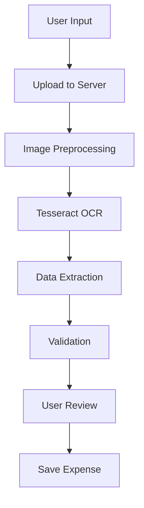

# 18 — Receipt OCR

This document specifies receipt scanning, OCR processing, and data extraction using Tesseract.

---

## 1. Supported Input Methods

| Method | Priority | Platforms |
|--------|----------|-----------|
| Camera capture | P1 | W, A |
| Image upload (gallery) | P1 | W, A |
| PDF upload | P2 | W, A |
| Shared invoice (WhatsApp) | P2 | WA |

---

## 2. Processing Pipeline



---

## 3. Image Preprocessing

### Steps

| Step | Purpose |
|------|---------|
| Grayscale conversion | Reduce complexity |
| Contrast enhancement | Improve text readability |
| Noise reduction | Remove artifacts |
| Deskew correction | Straighten tilted images |
| Binarization | Convert to black/white |
| Border detection | Crop to receipt area |

### Implementation

- Library: OpenCV (Python) or Imagick (PHP)
- Processing: Synchronous for small images, queued for large

---

## 4. Tesseract OCR Configuration

### Setup

| Property | Value |
|----------|-------|
| Engine | Tesseract 5.x |
| Languages | eng, hin (Hindi), eng+hin (mixed) |
| Mode | PSM 6 (uniform block of text) |
| Output | Text + confidence per character |

### Processing

```php
// PHP Imagick + Tesseract
$imagick = new Imagick();
$imagick->readImageBlob($imageData);
$imagick->setImageColorspace(Imagick::COLORSPACE_GRAY);
$imagick->contrastImage(20);
$imagick->unsharpMaskImage(0, 1, 0.5, 0.02);

// OCR
$text = $imagick->getImageText(); // Uses Tesseract
```

---

## 5. Data Extraction

### Fields Extracted

| Field | Priority | Method |
|-------|----------|--------|
| Total amount | P0 | Regex: `total`, `amount`, `₹`, `rs` |
| Merchant name | P1 | Top of receipt, logo detection |
| Date | P1 | Regex: date patterns |
| Items | P2 | Line item parsing |
| Tax | P2 | Regex: `tax`, `gst`, `vat` |
| Discounts | P3 | Regex: `discount`, `off` |

### Amount Extraction Patterns

```php
$patterns = [
    '/total\s*[:\s]*₹?\s*([\d,]+\.?\d*)/i',
    '/amount\s*[:\s]*₹?\s*([\d,]+\.?\d*)/i',
    '/₹\s*([\d,]+\.?\d*)/',
    '/rs\.?\s*([\d,]+\.?\d*)/i',
    '/grand\s*total\s*[:\s]*([\d,]+\.?\d*)/i',
];
```

### Date Extraction Patterns

```php
$datePatterns = [
    '/(\d{2})[\/\-](\d{2})[\/\-](\d{4})/',  // DD/MM/YYYY
    '/(\d{4})[\/\-](\d{2})[\/\-](\d{2})/',  // YYYY-MM-DD
    '/(\d{1,2})\s+(jan|feb|mar|apr|may|jun|jul|aug|sep|oct|nov|dec)\w*\s+(\d{4})/i',
];
```

### Item Extraction

```php
// Parse line items: "Item Name    ₹200"
$itemPattern = '/^(.+?)\s+₹?\s*([\d,]+\.?\d*)$/';
```

---

## 6. OCR Confidence

### Per-Field Confidence

Each extracted field has a confidence score (0.0-1.0):

| Confidence | Action |
|-----------|--------|
| ≥ 0.90 | Auto-fill, show for confirmation |
| 0.70 - 0.89 | Auto-fill, highlight for review |
| 0.50 - 0.69 | Show suggestion, require manual entry |
| < 0.50 | Skip, require manual entry |

### Overall Receipt Confidence

```
overall_confidence = weighted_average(
  amount_confidence * 0.4 +
  date_confidence * 0.2 +
  merchant_confidence * 0.2 +
  items_confidence * 0.2
)
```

---

## 7. User Review

### Review Screen

System shows:
1. Original receipt image (zoomable)
2. Extracted fields with edit capability
3. Confidence indicators per field
4. "Accept All" / "Edit Manually" buttons

### Pre-filled Form

```json
{
  "amount": { "value": 1500.00, "confidence": 0.95 },
  "description": { "value": "Restaurant Bill", "confidence": 0.88 },
  "date": { "value": "2026-09-15", "confidence": 0.92 },
  "items": [
    { "name": "Paneer Tikka", "price": 300.00, "confidence": 0.85 },
    { "name": "Naan", "price": 120.00, "confidence": 0.78 }
  ]
}
```

---

## 8. Database: `receipts`

| Field | Type | Purpose |
|-------|------|---------|
| id | INT UNSIGNED PK | Receipt ID |
| expense_id | INT UNSIGNED FK | Linked expense |
| user_id | INT UNSIGNED FK | Uploader |
| image_path | VARCHAR(500) | File path |
| ocr_raw_text | TEXT | Raw OCR output |
| ocr_extracted | JSON | Extracted structured data |
| ocr_confidence | DECIMAL(3,2) | Overall confidence |
| status | ENUM | pending/reviewed/accepted |
| created_at | TIMESTAMP | Upload time |

---

## 9. File Storage

| Rule | Value |
|------|-------|
| Storage path | `/storage/receipts/{user_id}/` |
| File naming | `{timestamp}_{hash}.{ext}` |
| Max size | 5 MB |
| Formats | JPG, PNG, PDF |
| Cleanup | Deleted 90 days after expense deletion |

---

## Open Questions

| # | Question | Impact |
|---|----------|--------|
| OQ-1 | Should we support handwritten receipts? | OCR complexity |
| OQ-2 | Should OCR processing be async (queued)? | UX latency |
| OQ-3 | Should we support multi-page PDF receipts? | Feature scope |

---

## Dependencies

- `07-EXPENSES.md` — Expense creation from OCR data
- `17-AI-AND-LLM.md` — AI extraction enhancement
- `22-BACKEND-ARCHITECTURE.md` — OCR service

## Related Documents

- `07-EXPENSES.md` — Receipt attachment in expenses
- `17-AI-AND-LLM.md` — AI extraction
- `20-DATABASE-SCHEMA.md` — receipts table
