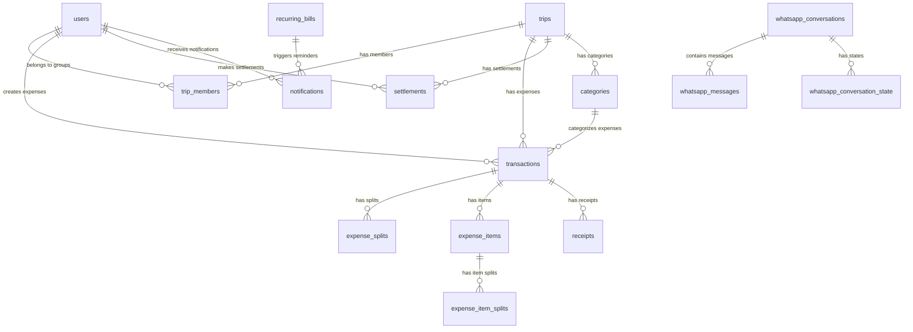

# 20 — Database Schema

This document is the complete database schema specification. Every table, field, index, and constraint is defined here. This is the **single source of truth** for all data structures.

---

## Existing Tables (from `sql/schema.sql`)

The current implementation has 13 tables. The specification below expands to cover all modules.

---

## 1. Core User & Auth Tables

### `users`

| Field | Type | Nullable | Default | Index | Purpose |
|-------|------|----------|---------|-------|---------|
| id | INT UNSIGNED PK | No | auto | PK | Unique user ID |
| name | VARCHAR(100) | No | — | — | Display name |
| email | VARCHAR(191) | Yes | NULL | UNIQUE | Email address |
| phone | VARCHAR(30) | Yes | NULL | UNIQUE | Phone number |
| phone_verified | TINYINT(1) | No | 0 | — | Phone verification status |
| email_verified | TINYINT(1) | No | 0 | — | Email verification status |
| google_id | VARCHAR(50) | Yes | NULL | INDEX | Google OAuth ID |
| auth_provider | ENUM('phone','google','email') | No | 'phone' | — | Auth method |
| password_hash | VARCHAR(255) | No | — | — | bcrypt hash |
| avatar_color | VARCHAR(20) | No | '#2563eb' | — | Avatar background color |
| is_admin | TINYINT(1) | No | 0 | — | System admin flag |
| created_at | TIMESTAMP | No | NOW() | INDEX | Registration time |

### `otp_sessions`

| Field | Type | Nullable | Default | Index | Purpose |
|-------|------|----------|---------|-------|---------|
| id | INT UNSIGNED PK | No | auto | PK | Session ID |
| phone | VARCHAR(30) | No | — | INDEX | Phone number |
| otp_code | VARCHAR(6) | No | — | — | OTP code (hashed) |
| expires_at | DATETIME | No | — | INDEX | Expiry timestamp |
| verified | TINYINT(1) | No | 0 | — | Verification status |
| attempts | INT | No | 0 | — | Attempt count |
| created_at | TIMESTAMP | No | NOW() | — | Creation time |

### `email_otp_sessions`

| Field | Type | Nullable | Default | Index | Purpose |
|-------|------|----------|---------|-------|---------|
| id | INT UNSIGNED PK | No | auto | PK | Session ID |
| email | VARCHAR(191) | No | — | INDEX | Email address |
| otp_code | VARCHAR(6) | No | — | — | OTP code (hashed) |
| expires_at | DATETIME | No | — | INDEX | Expiry timestamp |
| verified | TINYINT(1) | No | 0 | — | Verification status |
| attempts | INT | No | 0 | — | Attempt count |
| created_at | TIMESTAMP | No | NOW() | — | Creation time |

### `user_sessions`

| Field | Type | Nullable | Default | Index | Purpose |
|-------|------|----------|---------|-------|---------|
| id | INT UNSIGNED PK | No | auto | PK | Session ID |
| user_id | INT UNSIGNED FK | No | — | INDEX | User reference |
| session_token | VARCHAR(255) UNIQUE | No | — | INDEX | Session token |
| ip_address | VARCHAR(45) | Yes | NULL | — | Client IP |
| user_agent | VARCHAR(500) | Yes | NULL | — | Client user agent |
| expires_at | DATETIME | No | — | INDEX | Expiry |
| created_at | TIMESTAMP | No | NOW() | — | Creation time |

### `devices`

| Field | Type | Nullable | Default | Index | Purpose |
|-------|------|----------|---------|-------|---------|
| id | INT UNSIGNED PK | No | auto | PK | Device ID |
| user_id | INT UNSIGNED FK | No | — | INDEX | User reference |
| device_token | VARCHAR(255) | No | — | INDEX | Push notification token |
| platform | ENUM('web','android','ios') | No | — | — | Device platform |
| last_active | TIMESTAMP | No | NOW() | — | Last activity |
| created_at | TIMESTAMP | No | NOW() | — | Registration time |

---

## 2. Group Tables

### `trips` (Groups)

| Field | Type | Nullable | Default | Index | Purpose |
|-------|------|----------|---------|-------|---------|
| id | INT UNSIGNED PK | No | auto | PK | Group ID |
| trip_code | VARCHAR(20) UNIQUE | No | — | INDEX | Shareable code |
| url_token | VARCHAR(8) UNIQUE | Yes | NULL | INDEX | URL-friendly token |
| name | VARCHAR(150) | No | — | — | Group name |
| description | TEXT | Yes | NULL | — | Description |
| starting_money | DECIMAL(12,2) | No | 0.00 | — | **Legacy field** — not used in current product. Groups do not have a shared cash pool. |
| starting_payer_id | INT UNSIGNED FK | Yes | NULL | — | Starting money contributor |
| starting_payment_method | ENUM('cash','upi','card','bank','other') | No | 'cash' | — | Starting payment method |
| currency | VARCHAR(10) | No | 'INR' | — | Currency code |
| currency_symbol | VARCHAR(5) | No | '₹' | — | Currency symbol |
| group_type | ENUM('trip','flat','event','custom') | No | 'trip' | — | Group type |
| group_icon | VARCHAR(50) | Yes | NULL | — | Group icon |
| is_archived | TINYINT(1) | No | 0 | — | Archive status |
| created_by | INT UNSIGNED FK | No | — | INDEX | Owner |
| created_at | TIMESTAMP | No | NOW() | — | Creation time |
| updated_at | TIMESTAMP | No | NOW() | ON UPDATE | Last update |

### `trip_members`

| Field | Type | Nullable | Default | Index | Purpose |
|-------|------|----------|---------|-------|---------|
| id | INT UNSIGNED PK | No | auto | PK | Membership ID |
| trip_id | INT UNSIGNED FK | No | — | INDEX | Group reference |
| user_id | INT UNSIGNED FK | No | — | INDEX | User reference |
| role | ENUM('owner','admin','member') | No | 'member' | — | Role in group |
| joined_at | TIMESTAMP | No | NOW() | — | Join timestamp |

**Unique constraint**: (`trip_id`, `user_id`)

### `member_accounts`

| Field | Type | Nullable | Default | Index | Purpose |
|-------|------|----------|---------|-------|---------|
| id | INT UNSIGNED PK | No | auto | PK | Account ID |
| trip_id | INT UNSIGNED FK | No | — | INDEX | Group reference |
| user_id | INT UNSIGNED FK | No | — | INDEX | User reference |
| payment_method | ENUM | No | 'upi' | — | Payment method |
| account_name | VARCHAR(100) | No | — | — | Account label |

---

## 3. Expense Tables

### `transactions`

| Field | Type | Nullable | Default | Index | Purpose |
|-------|------|----------|---------|-------|---------|
| id | INT UNSIGNED PK | No | auto | PK | Transaction ID |
| trip_id | INT UNSIGNED FK | Yes | NULL | INDEX | Group (NULL=personal) |
| type | ENUM('expense','income','settlement') | No | — | INDEX | Transaction type |
| amount | DECIMAL(12,2) | No | — | — | Amount |
| description | VARCHAR(255) | No | — | — | Description |
| category_id | INT UNSIGNED FK | Yes | NULL | — | Category |
| paid_by | INT UNSIGNED FK | Yes | NULL | INDEX | Who paid |
| received_by | INT UNSIGNED FK | Yes | NULL | — | Who received |
| payment_method | ENUM | No | 'cash' | — | Payment method |
| paid_from_pool | TINYINT(1) | No | 1 | — | **Legacy field** — always 1 for shared expenses in current product |
| is_personal | TINYINT(1) | No | 0 | — | Personal expense flag |
| client_request_id | VARCHAR(36) | Yes | NULL | UNIQUE | Idempotency key |
| whatsapp_message_id | VARCHAR(100) | Yes | NULL | INDEX | WhatsApp dedup key |
| created_by | INT UNSIGNED FK | No | — | INDEX | Record creator |
| transaction_date | DATETIME | No | — | INDEX | Expense date |
| notes | TEXT | Yes | NULL | — | Notes |
| receipt_path | VARCHAR(500) | Yes | NULL | — | Receipt file path |
| created_at | TIMESTAMP | No | NOW() | INDEX | Record creation |
| updated_at | TIMESTAMP | No | NOW() | ON UPDATE | Last update |

### `expense_splits`

| Field | Type | Nullable | Default | Index | Purpose |
|-------|------|----------|---------|-------|---------|
| id | INT UNSIGNED PK | No | auto | PK | Split ID |
| transaction_id | INT UNSIGNED FK | No | — | INDEX | Parent expense |
| user_id | INT UNSIGNED FK | No | — | INDEX | Participant |
| amount | DECIMAL(12,2) | No | — | — | Share amount |
| created_at | TIMESTAMP | No | NOW() | — | Record time |

**Unique constraint**: (`transaction_id`, `user_id`)

### `expense_items`

| Field | Type | Nullable | Default | Index | Purpose |
|-------|------|----------|---------|-------|---------|
| id | INT UNSIGNED PK | No | auto | PK | Item ID |
| expense_id | INT UNSIGNED FK | No | — | INDEX | Parent expense |
| name | VARCHAR(255) | No | — | — | Item name |
| quantity | INT | No | 1 | — | Quantity |
| unit_price | DECIMAL(12,2) | No | — | — | Price per unit |
| total_price | DECIMAL(12,2) | No | — | — | quantity × unit_price |

### `expense_item_splits`

| Field | Type | Nullable | Default | Index | Purpose |
|-------|------|----------|---------|-------|---------|
| id | INT UNSIGNED PK | No | auto | PK | Split ID |
| item_id | INT UNSIGNED FK | No | — | INDEX | Parent item |
| user_id | INT UNSIGNED FK | No | — | INDEX | Participant |
| amount | DECIMAL(12,2) | No | — | — | Share of item |

---

## 4. Settlement Table

### `settlements`

| Field | Type | Nullable | Default | Index | Purpose |
|-------|------|----------|---------|-------|---------|
| id | INT UNSIGNED PK | No | auto | PK | Settlement ID |
| trip_id | INT UNSIGNED FK | No | — | INDEX | Group reference |
| transaction_id | INT UNSIGNED FK | Yes | NULL | — | Linked transaction |
| from_user | INT UNSIGNED FK | No | — | INDEX | Payer |
| to_user | INT UNSIGNED FK | No | — | INDEX | Receiver |
| amount | DECIMAL(12,2) | No | — | — | Amount paid |
| payment_method | ENUM | No | 'upi' | — | Payment method |
| status | ENUM('pending','paid') | No | 'paid' | — | Status |
| notes | TEXT | Yes | NULL | — | Notes |
| paid_at | DATETIME | No | — | — | Payment time |
| created_at | TIMESTAMP | No | NOW() | — | Record time |

---

## 5. Category Table

### `categories`

| Field | Type | Nullable | Default | Index | Purpose |
|-------|------|----------|---------|-------|---------|
| id | INT UNSIGNED PK | No | auto | PK | Category ID |
| trip_id | INT UNSIGNED FK | Yes | NULL | INDEX | Group (NULL=global) |
| user_id | INT UNSIGNED FK | Yes | NULL | — | User (NULL=shared) |
| name | VARCHAR(50) | No | — | — | Category name |
| icon | VARCHAR(50) | No | 'tag' | — | Lucide icon name |
| color | VARCHAR(20) | No | '#64748b' | — | Hex color |
| is_default | TINYINT(1) | No | 0 | — | Default category flag |
| type | ENUM('expense','income') | No | 'expense' | — | Category type |
| created_at | TIMESTAMP | No | NOW() | — | Creation time |

---

## 6. Bills & Reminders Table

### `recurring_bills`

| Field | Type | Nullable | Default | Index | Purpose |
|-------|------|----------|---------|-------|---------|
| id | INT UNSIGNED PK | No | auto | PK | Bill ID |
| user_id | INT UNSIGNED FK | No | — | INDEX | Owner |
| trip_id | INT UNSIGNED FK | Yes | NULL | — | Group context |
| name | VARCHAR(255) | No | — | — | Bill name |
| amount | DECIMAL(12,2) | Yes | NULL | — | Fixed amount (NULL=variable) |
| category_id | INT UNSIGNED FK | Yes | NULL | — | Category |
| recurrence | ENUM | No | — | — | Recurrence pattern |
| custom_interval_days | INT | Yes | NULL | — | Custom interval |
| due_day | INT | Yes | NULL | — | Day of month/week |
| next_due_date | DATE | No | — | INDEX | Next due date |
| reminder_days_before | INT | No | 1 | — | Reminder timing |
| priority | ENUM('high','medium','low') | No | 'medium' | — | Priority |
| is_active | TINYINT(1) | No | 1 | — | Active status |
| payment_method | ENUM | Yes | NULL | — | Payment method |
| notes | TEXT | Yes | NULL | — | Notes |
| created_at | TIMESTAMP | No | NOW() | — | Creation time |
| updated_at | TIMESTAMP | No | NOW() | ON UPDATE | Last update |

---

## 7. Notification Tables

### `notifications`

| Field | Type | Nullable | Default | Index | Purpose |
|-------|------|----------|---------|-------|---------|
| id | INT UNSIGNED PK | No | auto | PK | Notification ID |
| user_id | INT UNSIGNED FK | No | — | INDEX | Recipient |
| trip_id | INT UNSIGNED FK | Yes | NULL | — | Related group |
| type | VARCHAR(50) | No | — | — | Notification type |
| title | VARCHAR(255) | No | — | — | Title |
| message | TEXT | No | — | — | Body |
| data | JSON | Yes | NULL | — | Extra data |
| is_read | TINYINT(1) | No | 0 | INDEX | Read status |
| created_at | TIMESTAMP | No | NOW() | — | Creation time |

---

## 8. WhatsApp Tables

### `whatsapp_messages`

| Field | Type | Nullable | Default | Index | Purpose |
|-------|------|----------|---------|-------|---------|
| id | INT UNSIGNED PK | No | auto | PK | Message ID |
| whatsapp_message_id | VARCHAR(100) UNIQUE | No | — | INDEX | WhatsApp message ID |
| sender_phone | VARCHAR(30) | No | — | INDEX | Sender |
| direction | ENUM('inbound','outbound') | No | — | — | Direction |
| message_text | TEXT | Yes | NULL | — | Text content |
| message_type | ENUM('text','image','document') | No | 'text' | — | Message type |
| media_url | VARCHAR(500) | Yes | NULL | — | Media URL |
| status | ENUM | No | 'received' | — | Processing status |
| conversation_state | VARCHAR(50) | Yes | NULL | — | Current state |
| ai_confidence | DECIMAL(3,2) | Yes | NULL | — | AI confidence |
| raw_payload | JSON | Yes | NULL | — | Full payload |
| created_at | TIMESTAMP | No | NOW() | — | Message time |

### `whatsapp_conversations`

| Field | Type | Nullable | Default | Index | Purpose |
|-------|------|----------|---------|-------|---------|
| id | INT UNSIGNED PK | No | auto | PK | Conversation ID |
| user_id | INT UNSIGNED FK | No | — | INDEX | User |
| phone_number | VARCHAR(30) | No | — | INDEX | Phone |
| state | VARCHAR(50) | No | 'idle' | — | Current state |
| context_data | JSON | Yes | NULL | — | Context |
| last_message_at | TIMESTAMP | No | NOW() | — | Last message |
| is_active | TINYINT(1) | No | 1 | — | Active flag |
| created_at | TIMESTAMP | No | NOW() | — | Start time |

### `whatsapp_conversation_state`

| Field | Type | Nullable | Default | Index | Purpose |
|-------|------|----------|---------|-------|---------|
| id | INT UNSIGNED PK | No | auto | PK | State ID |
| conversation_id | INT UNSIGNED FK | No | — | INDEX | Conversation |
| state_name | VARCHAR(50) | No | — | — | State name |
| state_data | JSON | Yes | NULL | — | State data |
| entered_at | TIMESTAMP | No | NOW() | — | Entry time |

### `whatsapp_message_queue`

| Field | Type | Nullable | Default | Index | Purpose |
|-------|------|----------|---------|-------|---------|
| id | INT UNSIGNED PK | No | auto | PK | Queue ID |
| whatsapp_message_id | VARCHAR(100) | No | — | INDEX | Dedup key |
| sender_phone | VARCHAR(30) | No | — | — | Sender |
| message_text | TEXT | No | — | — | Content |
| status | ENUM | No | 'pending' | INDEX | Queue status |
| attempts | INT | No | 0 | — | Retry count |
| created_at | TIMESTAMP | No | NOW() | — | Queue time |
| processed_at | TIMESTAMP | Yes | NULL | — | Processing time |

---

## 9. AI & OCR Tables

### `ai_processing_logs`

| Field | Type | Nullable | Default | Index | Purpose |
|-------|------|----------|---------|-------|---------|
| id | INT UNSIGNED PK | No | auto | PK | Log ID |
| message_id | INT UNSIGNED FK | Yes | NULL | — | WhatsApp message |
| input_text | TEXT | No | — | — | Input |
| extracted_data | JSON | Yes | NULL | — | Extracted JSON |
| confidence | DECIMAL(3,2) | Yes | NULL | — | Confidence |
| processing_time_ms | INT | Yes | NULL | — | Latency |
| model_used | VARCHAR(50) | Yes | NULL | — | Model name |
| created_at | TIMESTAMP | No | NOW() | — | Log time |

### `receipts`

| Field | Type | Nullable | Default | Index | Purpose |
|-------|------|----------|---------|-------|---------|
| id | INT UNSIGNED PK | No | auto | PK | Receipt ID |
| expense_id | INT UNSIGNED FK | Yes | NULL | — | Linked expense |
| user_id | INT UNSIGNED FK | No | — | INDEX | Uploader |
| image_path | VARCHAR(500) | No | — | — | File path |
| ocr_raw_text | TEXT | Yes | NULL | — | Raw OCR output |
| ocr_extracted | JSON | Yes | NULL | — | Extracted data |
| ocr_confidence | DECIMAL(3,2) | Yes | NULL | — | Overall confidence |
| status | ENUM | No | 'pending' | — | Review status |
| created_at | TIMESTAMP | No | NOW() | — | Upload time |

### `imported_bills`

| Field | Type | Nullable | Default | Index | Purpose |
|-------|------|----------|---------|-------|---------|
| id | INT UNSIGNED PK | No | auto | PK | Import ID |
| user_id | INT UNSIGNED FK | No | — | INDEX | Importer |
| vendor | VARCHAR(50) | No | — | — | Vendor name |
| order_id | VARCHAR(100) | No | — | INDEX | Vendor order ID |
| raw_data | JSON | No | — | — | Original data |
| mapped_data | JSON | Yes | NULL | — | Mapped data |
| expense_id | INT UNSIGNED FK | Yes | NULL | — | Created expense |
| status | ENUM | No | 'pending' | — | Import status |
| created_at | TIMESTAMP | No | NOW() | — | Import time |

---

## 10. System Tables

### `app_settings`

| Field | Type | Nullable | Default | Index | Purpose |
|-------|------|----------|---------|-------|---------|
| id | INT UNSIGNED PK | No | auto | PK | Setting ID |
| setting_key | VARCHAR(100) UNIQUE | No | — | INDEX | Key |
| setting_value | TEXT | Yes | NULL | — | Value |
| setting_group | VARCHAR(50) | No | 'general' | INDEX | Group |
| description | VARCHAR(255) | Yes | NULL | — | Description |
| created_at | TIMESTAMP | No | NOW() | — | Creation time |
| updated_at | TIMESTAMP | No | NOW() | ON UPDATE | Last update |

### `admin_users`

| Field | Type | Nullable | Default | Index | Purpose |
|-------|------|----------|---------|-------|---------|
| id | INT UNSIGNED PK | No | auto | PK | Admin ID |
| username | VARCHAR(50) UNIQUE | No | — | INDEX | Username |
| password_hash | VARCHAR(255) | No | — | — | Password hash |
| name | VARCHAR(100) | No | — | — | Display name |
| last_login | DATETIME | Yes | NULL | — | Last login |
| created_at | TIMESTAMP | No | NOW() | — | Creation time |

### `audit_logs`

| Field | Type | Nullable | Default | Index | Purpose |
|-------|------|----------|---------|-------|---------|
| id | INT UNSIGNED PK | No | auto | PK | Log ID |
| user_id | INT UNSIGNED FK | Yes | NULL | INDEX | User |
| action | VARCHAR(100) | No | — | INDEX | Action type |
| entity_type | VARCHAR(50) | No | — | — | Entity type |
| entity_id | INT UNSIGNED | No | — | — | Entity ID |
| old_values | JSON | Yes | NULL | — | Before state |
| new_values | JSON | Yes | NULL | — | After state |
| ip_address | VARCHAR(45) | Yes | NULL | — | Client IP |
| created_at | TIMESTAMP | No | NOW() | INDEX | Action time |

### `exports`

| Field | Type | Nullable | Default | Index | Purpose |
|-------|------|----------|---------|-------|---------|
| id | INT UNSIGNED PK | No | auto | PK | Export ID |
| user_id | INT UNSIGNED FK | No | — | INDEX | Requester |
| type | ENUM('csv','pdf','excel') | No | — | — | Export format |
| scope | ENUM('personal','group') | No | — | — | Export scope |
| trip_id | INT UNSIGNED FK | Yes | NULL | — | Group (if group export) |
| file_path | VARCHAR(500) | Yes | NULL | — | Generated file |
| status | ENUM('pending','completed','failed') | No | 'pending' | — | Status |
| created_at | TIMESTAMP | No | NOW() | — | Request time |
| completed_at | TIMESTAMP | Yes | NULL | — | Completion time |

### `imports`

| Field | Type | Nullable | Default | Index | Purpose |
|-------|------|----------|---------|-------|---------|
| id | INT UNSIGNED PK | No | auto | PK | Import ID |
| user_id | INT UNSIGNED FK | No | — | INDEX | Importer |
| source | VARCHAR(50) | No | — | — | Import source |
| file_path | VARCHAR(500) | Yes | NULL | — | Uploaded file |
| rows_total | INT | No | 0 | — | Total rows |
| rows_imported | INT | No | 0 | — | Imported rows |
| rows_failed | INT | No | 0 | — | Failed rows |
| status | ENUM | No | 'pending' | — | Import status |
| error_log | JSON | Yes | NULL | — | Error details |
| created_at | TIMESTAMP | No | NOW() | — | Request time |

---

## Indexes Summary

### Existing (from schema.sql)

```sql
CREATE INDEX idx_transactions_trip ON transactions(trip_id, transaction_date);
CREATE INDEX idx_transactions_user ON transactions(created_by, transaction_date);
CREATE INDEX idx_transactions_type ON transactions(type);
CREATE INDEX idx_splits_trans ON expense_splits(transaction_id);
CREATE INDEX idx_splits_user ON expense_splits(user_id);
CREATE INDEX idx_settlements_trip ON settlements(trip_id);
CREATE INDEX idx_settlements_users ON settlements(from_user, to_user);
```

### New (for expanded schema)

```sql
-- Users
CREATE INDEX idx_users_phone ON users(phone);
CREATE INDEX idx_users_email ON users(email);
CREATE INDEX idx_users_google ON users(google_id);

-- Sessions
CREATE INDEX idx_sessions_user ON user_sessions(user_id);
CREATE INDEX idx_sessions_token ON user_sessions(session_token);
CREATE INDEX idx_sessions_expires ON user_sessions(expires_at);

-- Transactions
CREATE INDEX idx_txn_client_request ON transactions(client_request_id);
CREATE INDEX idx_txn_whatsapp ON transactions(whatsapp_message_id);
CREATE INDEX idx_txn_category ON transactions(category_id);
CREATE INDEX idx_txn_personal ON transactions(is_personal, created_by);

-- Notifications
CREATE INDEX idx_notif_user ON notifications(user_id);
CREATE INDEX idx_notif_read ON notifications(is_read);

-- WhatsApp
CREATE INDEX idx_wa_sender ON whatsapp_messages(sender_phone);
CREATE INDEX idx_wa_conversation ON whatsapp_conversations(user_id);
CREATE INDEX idx_wa_queue_status ON whatsapp_message_queue(status);

-- Audit
CREATE INDEX idx_audit_user ON audit_logs(user_id);
CREATE INDEX idx_audit_action ON audit_logs(action);
CREATE INDEX idx_audit_entity ON audit_logs(entity_type, entity_id);

-- Bills
CREATE INDEX idx_bills_user ON recurring_bills(user_id);
CREATE INDEX idx_bills_due ON recurring_bills(next_due_date);

-- Receipts
CREATE INDEX idx_receipts_user ON receipts(user_id);
CREATE INDEX idx_receipts_expense ON receipts(expense_id);
```

---

## Entity Relationship Diagram



---

## Open Questions

| # | Question | Impact |
|---|----------|--------|
| OQ-1 | Should we add a `friends` table for formal friend relationships? | Schema change |
| OQ-2 | Should `audit_logs` have a retention period with auto-cleanup? | Storage |
| OQ-3 | Should we add a `budgets` table for spending limits? | Feature scope |

---

## Dependencies

- All module documents define requirements for these tables

## Related Documents

- `21-API-SPECIFICATION.md` — API endpoints that use these tables
- `22-BACKEND-ARCHITECTURE.md` — Backend models mapping to these tables
- All module docs reference specific tables from this document
